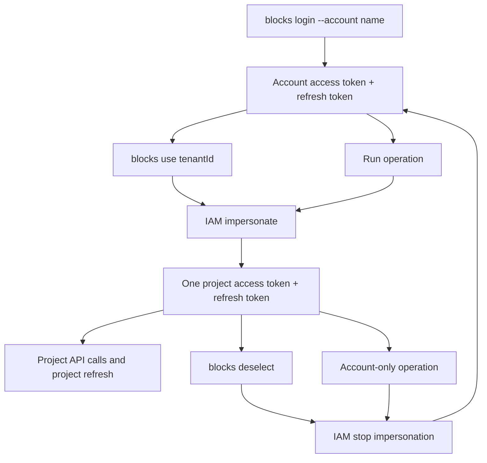

# Blocks CLI Guide for AI Agents

This guide is for AI agents using the published `@seliseblocks/cli-os` npm package. The installed binary is `blocks`.

Use `blocks` as the control plane. If a capability exists in the CLI, call the CLI from the terminal instead of calling Blocks cloud APIs directly from ad hoc scripts or generated application code.

## Install

Install the package in the environment where the agent will operate:

```bash
npm install -g @seliseblocks/cli-os
```

Verify the binary:

```bash
blocks --version
blocks --help
```

### Check the version before working

An installed CLI silently ages: commands, flags, and scaffold behavior in this
guide describe the latest release, not whatever happens to be on the machine.
At the start of a session, compare the installed version against the registry:

```bash
blocks --version
npm view @seliseblocks/cli-os version
```

If the installed version is behind, tell the user both versions and ask for
their confirmation to run `npm install -g @seliseblocks/cli-os@latest`. Never
update on your own initiative. If they decline, continue on the old version and
expect drift from documented flags and defaults; say so when something is
missing rather than working around it silently.

The CLI also helps from 0.3.2 onward: after each command it prints an
`Update available` notice to stderr (checked against the registry at most once
every 24 hours, cached in the config directory) and `blocks doctor --json`
reports `cliVersion`, `latestCliVersion`, and `cliUpdateAvailable` from that
cache. Treat that notice exactly like the manual check above: inform, ask,
and only then update. Set `BLOCKS_NO_UPDATE_CHECK=1` to disable the check.

For local package development only, contributors may run `node bin/run.js ...` from the source repository. AI agents consuming the npm package should use `blocks ...`.

## Global Options

Namespaced commands accept either spaces or colons, e.g. `blocks data schema list` and
`blocks data:schema:list` are equivalent. Global options available on every command:

- `--json` - print machine-readable JSON where supported.
- `--api-url <url>` - override the Blocks API URL for this command.
- `--account <name>` - use exactly that named account in the resolved config store; never falls back to another account.
- `--project <tenantId>` - override the project for this command without changing the saved selection.
- `--dry-run` / `--yes` - see Operating Rules below.

### Looking commands up cheaply

Three queries, smallest first. Prefer them over the full text help, which is ~47 KB and cannot be read in part:

```bash
blocks --help --json                    # every command name, grouped by family (~8 KB)
blocks help <family> [--json]           # one family, with summaries (e.g. 'blocks help mfa')
blocks help <command> [--json]          # one command: usage, flags, scope, mutation (~0.8 KB)
```

`<command> --help` and `-h` are safe too: both are intercepted before dispatch
and render the same thing `blocks help <command>` does, so no handler ever sees
them. (They were not always — `--help` used to reach the handler as an ordinary
argument, and `login --help` performed a real login attempt. Any older guidance
warning you off that spelling is describing a CLI before 0.3.0.)

**A flag the command does not read is now reported, not ignored.** A misspelled
flag prints a warning to stderr naming it, and the command still runs with that
value dropped. Treat that warning as a failure: re-read `blocks help <command>`,
fix the spelling, and re-run before approving any mutation, because the dry-run
you just showed the user was missing a field. In non-interactive runs set
`BLOCKS_STRICT_FLAGS=1` so the CLI exits 1 with `code: "unknown_flag"` instead of
warning past it.

Every field it reports is derived from the command's own source, not from prose, so `flags`, `scope`, and `mutating` cannot drift from behavior. `blocks --help` (no subcommand) remains the human-readable overview.

## Operating Rules

- Use `blocks ...` for all supported Blocks OS, IAM, Data, Release, and scaffold operations.
- Prefer `--json` for automation and parsing.
- Use `--dry-run` before any mutating command. On `save`/`update` commands the dry-run body is the merged record (current server state with your flags applied), because those endpoints replace the whole document -- read it as "this is exactly what will be stored", and re-read state after `--yes`.
- Do not run real mutating cloud commands unless the user explicitly approved the exact action.
- Never print, commit, scaffold, or document access tokens, refresh tokens, cookies, JWTs, or other secrets.
- Treat any secret pasted into chat or logs as exposed and rotate it before production use.
- Generated apps must not contain CLI tokens.
- If a CLI command returns an error, fix or report the CLI path. Do not bypass the CLI with a one-off API request when the command exists.
- Run `blocks` commands one at a time per resolved config directory. Token transitions are mutex-protected; parallel invocations can fail with `auth_transition_busy`.
- Treat every paginated `list` result as one page. Read `totalCount` when the response provides it, and request subsequent pages when completeness matters; never report a total from the returned array length alone.

## Login

The CLI resolves its state store from non-empty `BLOCKS_CONFIG_DIR`, otherwise
from the normal per-user OS config directory. The same store owns account
profiles, `activeAccount`, selected project, tokens, and secrets. Do not infer VM
or Studio state inside the CLI.

Account resolution is `--account`, then the valid `activeAccount` in that store.
If neither exists, interactive terminals select from configured accounts and
non-interactive commands fail. Project resolution is `--project`, then
`blocks.json` `project.tenantId`, then the resolved account's `selectedProject`; interactive
terminals ask for a tenant id only if all are missing, while non-interactive
commands fail. Automation should pass both flags explicitly.

Device-code login uses the packaged OS client id. It prints a verification URL and user code, opens the browser to the verification page when possible, then polls until approved:

```bash
blocks login --account <name>
```

Login is the explicit bootstrap path for a missing named profile. It creates
profile metadata from packaged defaults and writes newly issued credentials only
to the resolved store. It never imports tokens from another account or directory.
Successful login sets `activeAccount`; normal project commands then use
`blocks use <tenantId>` and `blocks deselect` without repeating `--account`.

The token store keeps one mode per account, never simultaneous account and
project refresh-token state:

```text
login -> account AT+RT -> use/impersonate -> project AT+RT
project AT+RT -> deselect/stop -> fresh account AT+RT
```

Project token refresh uses the project RT directly. Account refresh and other
account-only operations temporarily stop an active project session and restore
it afterward. Token-mode transitions are serialized per resolved config
directory. Fresh login, impersonation, and stop responses must contain a refresh
token; ordinary refresh responses may omit it when the existing RT remains
valid.

Check current auth state:

```bash
blocks auth status --json
```

If local auth state is stale or corrupted (Windows profile change, machine migration, Keychain reset), clear local auth state and log in again:

```bash
blocks auth remove <account>
blocks login --account <account>
```

Use `blocks logout`, `blocks auth refresh [--project] --json` as needed — see `blocks help auth` for exact behavior.

For Code Studio, authorization happens before launch: the portal backend must
validate portal user identity plus `x-blocks-key` plus the requested Studio
application/project. `x-blocks-key` identifies the tenant/project only and is not
proof of permission. The launcher must assign a unique session/user-specific
`BLOCKS_CONFIG_DIR`; the CLI uses only that context and performs no VM detection.

### AI agent startup

First check the CLI is current (see "Check the version before working" above):
compare `blocks --version` with `npm view @seliseblocks/cli-os version`, and if
it is behind, tell the user and ask before updating.

For normal local work, leave `BLOCKS_CONFIG_DIR` unchanged and use the user's
OS-scoped store. Probe with `blocks auth status --json`; if login is missing,
ask for the account name, run `blocks login --account <name>`, relay the device
URL/code, and wait for approval. Do not create an isolated directory and copy
existing credentials into it.

In Code Studio, the launcher provides `BLOCKS_CONFIG_DIR` and authentication
context before the agent starts. Never change that directory or fall back to OS
state. If `blocks auth status --json` reports missing context, report a
launcher/bootstrap failure. The current CLI has no unattended Studio bootstrap
command, so device login requires explicit user approval unless the platform
implements an approved backend bootstrap flow.

After resolution, agent automation passes `--account <name>` and
`--project <tenantId>` explicitly. Interactive local use may rely on the active
account and its account-specific selection.

Run cache-only health checks without token refresh or network mutation:

```bash
blocks doctor --json
```


### Session state machine

Each account persists exactly one refreshable authentication mode in its resolved
store: either the account access/refresh pair, or one project's impersonated pair.
`blocks use` exchanges account mode for project mode; `blocks deselect` exchanges it
back. Account-only operations such as project creation temporarily stop impersonation
and restore the previous project afterward. These exchanges are locked per config
directory so concurrent CLI processes cannot overwrite each other's token transition.



### Multi-user hosts (Code Studio)

The portal backend must validate the portal identity, `x-blocks-key`, and the
requested Studio application/project before creating a session. `x-blocks-key`
identifies a tenant/project; it does not prove user permission. The launcher must
supply a unique session/user-specific `BLOCKS_CONFIG_DIR`; a new directory starts
with no imported tokens and requires an explicit login or approved bootstrap. Local
terminals without an override use the normal OS config directory, so two portal users
can share a tenant on one VM without sharing account, project selection, secrets, or
tokens.

## Project Workflow

List projects:

```bash
blocks projects list --json
```

Create a project when none suitable exists (ask the user first - it accepts the Blocks terms on their behalf; see `blocks help projects create` for exact behavior — dev-only environment, terms confirmation, session handling):

```bash
blocks projects create "<project name>" --json      # add --dry-run first to show the payload
```

It does not select the new project; run `blocks use <tenantId>` with the returned id.

Select a project:

```bash
blocks use <projectTenantId>
```

Read the selected project:

```bash
blocks projects get --json
```

If an impersonated project token has expired or failed and re-running the command doesn't
recover, clear the selection and reselect to force re-impersonation:

```bash
blocks deselect
blocks use <projectTenantId>
```

## Scaffold a Web App

Generate a React/Vite Blocks app. All of `--x-blocks-key`, `--app-domain`, and `--client-id` are optional now - they're resolved from the selected project when omitted:

```bash
blocks use <projectTenantId>   # if not already selected
blocks new web <appName>
```

This is interactive when a value isn't already known (domain pick-list; OIDC client pick-list, create-new, or skip — see `blocks help new web` for the exact prompts). Do not fabricate a client id or domain value yourself.

**An AI agent running this non-interactively cannot answer these prompts.** The CLI fails with `interactive_input_required` instead of waiting on stdin. Before running `new web`, gather the values yourself and pass them explicitly:

```bash
blocks projects get --json                     # see the project's domain(s) under project.applications
blocks auth oidc-clients list --json           # see existing OIDC clients, if any
```

Then run with explicit flags. The command checks AuthController and may enable OIDC login before scaffolding; after the user approves that possible tenant mutation, pass `--yes` so no non-interactive confirmation is reached:

```bash
blocks new web <appName> --x-blocks-key <projectTenantId> --app-domain <appDomainOrUrl> --client-id <publicOidcClientId> --yes
```

`new web` also accepts `--blocks-api-url <url>` and `--oidc-url <url>`. When `--blocks-api-url` is omitted, the scaffold derives it from the app domain as
`https://blocksapi.<registrable-domain>`; for example `https://dqrsf.slsblx.com` becomes
`https://blocksapi.slsblx.com`. Pass `--blocks-api-url` only when targeting a non-default Blocks gateway. `--oidc-url` defaults to `https://iam.seliseblocks.com`.

Validate the scaffold:

```bash
cd <appName>
npm install
npm run build
```

Do not pass CLI auth state to the scaffolded app. Browser apps must use a public OIDC client and the SDK hosted IdP flow: `blocksClient.auth.idp.redirectToProvider()` on login click and `blocksClient.auth.idp.callback()` on `/login/callback`.

`--app-domain` is the app's real Blocks domain/origin, for example `https://dbpdba.seliseblocks.com`. The generated `.env` keeps that full value as `VITE_BLOCKS_APP_DOMAIN` and derives the local dev host without a scheme as `VITE_BLOCKS_DEV_HOST=dbpdba.seliseblocks.com`.

For local browser login on the real host domain:

1. Add `127.0.0.1 <VITE_BLOCKS_DEV_HOST>` to the hosts file **yourself** (elevated on Windows, `sudo` elsewhere), then tell the user it was added - never stop and ask the user to edit the hosts file by hand. The blocks-frontend-local-https skill has the idempotent add-and-verify commands for each OS.
2. Run `npm install`.
3. Run `npm run cert`.
4. Run `npm run dev`.
5. Open `https://<VITE_BLOCKS_DEV_HOST>:5173`, not plain `http://`.

The generated cert script uses the `selfsigned` Node dependency, so it works from normal PowerShell after `npm install`; do not tell Windows users to switch to Git Bash just for OpenSSL. If hosted login or secure cookies fail locally, confirm the app is opened with the HTTPS dev URL from `VITE_BLOCKS_DEV_HOST`.

## IAM, MFA, and Auth Admin

`iam me` reads the CLI operator's identity. It prefers an impersonated project token when a project resolves and falls back to account auth only when none does:

```bash
blocks iam me --json
```

Every other command below is strictly project-scoped: it requires a selected project and always calls IAM through an impersonated project token. If no project is selected, it fails with `project_not_selected`.

See `blocks help iam`, `blocks help mfa`, and `blocks help auth` for the full
family list, summaries, and flags — every family (`iam users`, `iam roles`,
`iam permissions`, `iam resources`, `iam organizations`, `iam signup-settings`,
`mfa config`/`totp`/`generate`/`resend`/`verify`/`method set`/`disable`/
`backup-codes`, `auth idp`, `auth config`, `auth client-credentials`,
`auth oidc-clients`, including the composed `mfa totp enable`) is covered
there and cannot drift from behavior the way prose can.

Rules:

- Use `--dry-run` before guarded configuration/admin mutations, then `--yes` only after explicit approval. MFA challenge/setup/verify/resend and backup-code consumption are live authentication protocol steps without dry-run; run them only inside the user's explicit authentication flow.
- Rich payloads (identity provider config, OIDC client config, user/role/permission create-update bodies, etc.) accept `--body '<json>'` or `--file <path.json>` on top of the documented convenience flags - use whichever is easier for the exact fields you need to set.
- `iam roles update`, `iam signup-settings save`, `iam permissions update`, `auth config save`, `auth oidc-clients save` and `auth client-credentials save --item-id` read the current record first and merge your flags over it, because their endpoints replace the whole document. Omitting a flag keeps the stored value. To clear a boolean, pass it explicitly (`--is-default=false`); to clear a text field, use `--body '{"description": ""}'` -- an empty convenience flag reads as "not passed" and keeps the stored value.
- `iam users update` is a sparse patch (the server keeps omitted/null fields itself, `""` via `--body` clears one), so it sends only the fields you pass and needs no read. Roles, permissions and MFA state are not part of this endpoint any more -- the CLI rejects them with a pointer to `iam users access grant` and the MFA commands.
- `iam users access grant`: a non-empty `--roles` or `--permissions` REPLACES that organization's list (an omitted one is kept). The dry-run prints `current` so you can see what a grant would drop; pass the complete set.
- `auth idp create`/`update`, `auth client-credentials save`, and `auth oidc-clients save`/`rotate-secret` can return a `client_secret` shown only once. Never print, log, commit, or otherwise persist it outside what the user explicitly asked to store; treat that response the same as any other CLI-managed secret.
- Do not add IAM/MFA/Auth admin behavior outside these supported CLI commands unless the CLI package is explicitly extended and tested.

## Data

Check the data-source configuration first. Most projects run on Blocks-managed storage by default, so this is usually the only `data config *` command you need:

```bash
blocks data config get --json
```

Only create/update a data source configuration after explicit user approval - it points the project's Data Gateway at a different (external) database, which is a deliberate, rare action:

```bash
blocks data config create --connection-string "<cs>" --database-name "<name>" --dry-run --json
blocks data config create --connection-string "<cs>" --database-name "<name>" --yes --json
blocks data config update --item-id <id> --connection-string "<cs>" --dry-run --json
blocks data config update --item-id <id> --connection-string "<cs>" --yes --json
```

Validate local files:

```bash
blocks data validate --json
```

List schemas:

```bash
blocks data schema list --json
```

Pull schemas:

```bash
blocks data schema pull --json
```

Push schemas only after dry-run and approval:

```bash
blocks data schema push --dry-run --json
blocks data schema push --yes --json
```

Pull rules:

```bash
blocks data rules pull --json
```

Deploy rules only after dry-run and approval:

```bash
blocks data rules deploy --dry-run --json
blocks data rules deploy --yes --json
```

Reload Data schema configuration only after approval:

```bash
blocks data reload --dry-run --json
blocks data reload --yes --json
```

**Prefer `data sync` over running validate/push/deploy/reload separately.** It composes all four (validate → `schema push` → `rules deploy` → `data reload`) behind one confirmation, and it's the only way to guarantee the reload actually happens - nothing else calls it automatically, so schema/rule changes pushed without a following `data reload` can sit staged without going live:

```bash
blocks data sync --dry-run --json
blocks data sync --yes --json
```

It validates first and hard-fails with no API calls made if schemas or the rules file don't parse/validate. It prints 3 separate step outputs (one per underlying command), not one combined JSON document - parse each block in sequence if you need machine-readable results from all three.

### Raw Data API

`validate`/`schema list`/`schema pull`/`schema push`/`rules pull`/`rules deploy`/`reload` above cover the common file-oriented workflow. The rest of `/data/v4/*` is exposed directly, project-scoped with an impersonated project token only — see `blocks help data` for the full family list (schema get/get-by-name/aggregation/change-logs/delete, schema info/fields, rules policy, validation, files) and `blocks help <command> --json` for exact flags.

Same rules as everywhere else: `--dry-run` before any mutating command, then `--yes` only after explicit approval.

**`--file` means two different things depending on the command.** Everywhere else in this CLI (`--body '<json>'`/`--file <path.json>`), `--file` is a JSON payload file read by `jsonBodyFlag`. On the `data files *` upload commands (`upload-to-url`, `upload-to-local-storage`), `--file` is instead the local binary file to read and upload - there is no JSON payload involved. Don't conflate the two: passing a JSON path to `data files upload-to-local-storage --file` uploads the JSON text as the file's bytes, it does not set a request body.

**Prefer the composed `data files upload` over the manual steps below.** For cloud storage it creates the file/version metadata and PUTs the bytes; for local storage it performs one multipart call. Either path creates the visible object directly—there is no DMS registration step:

```bash
blocks data files upload --file ./invoice.pdf --access-modifier Public --dry-run --json
blocks data files upload --file ./invoice.pdf --access-modifier Public --yes --json
blocks data files upload --file ./invoice.pdf --local-storage --yes --json   # local-storage-backed projects
```

Manual cloud-storage upload, if you need the intermediate steps for some reason (two calls):

```bash
blocks data files presigned-upload-url --name invoice.pdf --access-modifier Public --dry-run --json
blocks data files presigned-upload-url --name invoice.pdf --access-modifier Public --yes --json
# take the returned uploadUrl and fileId, then:
blocks data files upload-to-url --url "<uploadUrl>" --file ./invoice.pdf --content-type application/pdf --dry-run --json
blocks data files upload-to-url --url "<uploadUrl>" --file ./invoice.pdf --content-type application/pdf --yes --json
```

Manual local-storage upload (one call):

```bash
blocks data files upload-to-local-storage --file ./invoice.pdf --access-modifier Public --dry-run --json
blocks data files upload-to-local-storage --file ./invoice.pdf --access-modifier Public --yes --json
```

Browse the resulting object tree with cursor pagination. Deletion defaults to trash:

```bash
blocks data files list --parent-id <directoryId> --limit 50 --json
blocks data files search invoice --directory-id <directoryId> --json
blocks data files delete <fileId> --dry-run --json
blocks data files delete <fileId> --yes --json
blocks data files trash --json
blocks data files restore <fileId> --dry-run --json
```

## Localization

Generate or update local i18n dictionaries as JSON, then let the CLI sync them to Blocks Localization. Do not ask humans to manually copy keys into the portal.

Default file convention:

```text
blocks/localization/<module>.<language>.json
```

Example:

```json
{
  "title": "Dashboard",
  "products.empty": "No products found"
}
```

The module already provides the namespace, so a `dashboard` module uses `title`, not `dashboard.title`. Nested JSON is accepted for meaningful key groups and flattened before validation:

```json
{
  "products": {
    "empty": "No products found"
  }
}
```

Validate first:

```bash
blocks localization validate --module common --language en --json
```

Push only after dry-run and approval:

```bash
blocks localization push --module common --language en --dry-run --json
blocks localization push --module common --language en --yes --json
```

Pull published cloud localization when local fallback files need to be refreshed:

```bash
blocks localization pull --module common --language en --json
```

Use Localization gateway v4 paths without `/api`: `/localization/v4/Module/Gets`, `/localization/v4/Module/Save`, `/localization/v4/Key/SaveKeys`, and `/localization/v4/Key/GetCloudUilmFile`.

### Raw Localization API

`validate`/`push`/`pull` above cover the common i18n file workflow. Every other `/localization/v4/*` endpoint is also exposed directly, project-scoped with an impersonated project token only (never the account token) — see `blocks help localization` for the full family list (assistant, config, glossary, key CRUD/search/timeline/translate/UILM, language, module — including the composed `translate-and-export`) and `blocks help <command> --json` for exact flags.

Same rules as everywhere else: `--dry-run` before any mutating command, then `--yes` only after explicit approval; rich payloads accept `--body '<json>'`/`--file <path.json>` on top of the documented convenience flags. `localization config save-webhook`'s `--secret` is redacted in `--dry-run` output only - treat the live response as a secret.

## Mail

Project-scoped SMTP/inbound mail configuration, templates, and mailbox reads via `/os/v4/Mail/*`:

```bash
blocks mail config list --json
blocks mail config get <name> --json
blocks mail config save --name <n> --host <h> --port <p> --enable-ssl \
  --sender-name <n> --sender-address <addr> --account-password <p> --dry-run --json
blocks mail config save --configuration-id <id> ... --yes --json   # update
blocks mail config delete <configurationId> --dry-run --json
blocks mail config duplicate <configurationId> --dry-run --json

blocks mail template list --configuration-id <id> --json
blocks mail template get <itemId> --json
blocks mail template save --configuration-id <id> --name <n> --language <l> \
  --subject <s> --template-body <html> --dry-run --json
blocks mail template delete <itemId> --dry-run --json
blocks mail template clone <itemId> --name <n> --dry-run --json

blocks mail mailbox list --inbound=false --page-number 1 --page-size 20 --json
blocks mail mailbox get <messageId> --json
```

Treat `--account-password` as a secret; the CLI redacts it in `--dry-run` output but the live response is still yours to protect.

Sending mail is a separate surface, `/logic/v4/Mail/Send` and `/logic/v4/Mail/SendToAny` (not `/os/v4`):

```bash
blocks mail send --to a@example.com,b@example.com --purpose welcome --language en \
  --subject-data-context '{"firstName":"Ada"}' --dry-run --json
blocks mail send --to a@example.com --purpose welcome --language en --yes --json

blocks mail sendtoany --to a@example.com --purpose welcome --language en \
  --is-test-mail --dry-run --json
```

`--project-key` defaults to the selected project's tenant id; pass it explicitly only to target a different one. `--attachments`/`--subject-data-context`/`--body-data-context` take raw JSON.

## Notification

Project-scoped notification channel configuration via `/os/v4/Notification/*`:

```bash
blocks notification list --json
blocks notification get <itemId> --json
blocks notification save --name <n> --channel <0|1> --type <0-3> --dry-run --json
blocks notification save --name <n> --channel <0|1> --type <0-3> --update --yes --json
blocks notification delete <itemId> --dry-run --json
```

`--channel` and `--type` are raw numeric enum values from the Blocks OS API (`NotifierTypes`, `NotificationReceiverTypes`) — the API does not publish names for them.

## Notifier

Real-time/offline notification sends and inbox reads via `/logic/v4/Notifier/*` — distinct from
`notification` above, which manages channel *configuration*, not sending:

```bash
blocks notifier notify --user-ids u1,u2 --response-key status --response-value ok --dry-run --json
blocks notifier notify --roles admin --denormalized-payload '{"orderId":"123"}' \
  --save-denormalized-payload-as-object --yes --json
blocks notifier notify --subscription-filters '[{"context":"orders","actionName":"created","value":"*"}]' --yes --json

blocks notifier list --unread-only --page 1 --page-size 20 --json
blocks notifier unread --user-id <id> --context orders --action-name created --order-by 1 --json
blocks notifier mark-read <notificationId> --dry-run --json
blocks notifier mark-all-read --dry-run --json
```

Target `notify` with at least one of `--user-ids`/`--roles`/`--subscription-filters`. `notifier unread`
sends its filter as query parameters even though swagger documents that endpoint as GET with a JSON
body, which the Fetch spec forbids — the CLI and SDK both flatten it into the query string instead.

## Storage

Project-scoped storage backend configuration via `/os/v4/Storage/*`:

```bash
blocks storage config list --json
blocks storage config get <name> --json
blocks storage config save --name <n> --strategy <s> --secret-key <k> --access-key <k> --dry-run --json
blocks storage config save --item-id <id> --update ... --yes --json   # update
blocks storage config delete <name> --dry-run --json
```

`--secret-key`, `--access-key`, `--password`, and `--connection-string` are secrets; the CLI redacts them in `--dry-run` output only.

## Captcha

Project-scoped login-captcha configuration via `/os/v4/captcha/*` (blocks-os). blocks-iam enforces the FIRST enabled configuration in id order at login; the CLI reports it as `activeForLogin`.

```bash
blocks captcha list --json
blocks captcha get <id> --json                                   # secretId only, never the value
blocks captcha save --provider recaptcha --captcha-key <siteKey> --captcha-secret <secret> --enable --dry-run --json
blocks captcha save <id> --provider recaptcha --captcha-secret <newSecret> --yes --json   # rotates the linked secret
blocks captcha enable <id> --yes --json                          # or: captcha disable <id>
blocks captcha delete <id> --dry-run --json                      # also retires the stored secret
```

`--captcha-secret` is redacted in `--dry-run` output and never echoed back; the stored secret cannot be read from the CLI, only replaced by re-saving with `--captcha-secret`. `enable`/`disable` re-save the record with only `isEnable` flipped and report which configuration is live afterwards -- read that field rather than assuming the one you enabled is enforced.

## Secrets

The project's secret store via `/os/v4/Secrets/*` (blocks-os). One record per secret with status (`active`|`locked`|`deleted`), an optional access list, rotation history and an audit trail. **The CLI never prints a secret value**: there is no read-value command, `get`/`list`/`audit` return metadata only, and dry-run output redacts values. If a user needs to read a value, that happens in the Blocks portal.

```bash
blocks secrets list --json
blocks secrets get <secretId> --json                             # metadata only
blocks secrets set <name> --value-file ./secret.txt --dry-run --json
blocks secrets set <name> --value-env MY_SECRET --yes --json     # returns {secretId}
blocks secrets set-many --env-file .env --dry-run --json         # one secret per KEY
blocks secrets rotate <secretId> --value-file ./new.txt --yes --json
blocks secrets access <secretId> --roles admin --merge --yes --json
blocks secrets lock <secretId> --yes --json                      # also: unlock | delete | restore
blocks secrets audit <secretId> --json
```

`set` always creates (names are not unique) -- change a value with `rotate` and metadata with `update`. The type is fixed by the CLI; there is no flag for it. Prefer `--value-file`/`--value-env` over `--value` so values stay out of shell history, and do not read the file or variable back yourself. Locked secrets refuse rotation (409 `invalid_state`) until `unlock`.

## Release

Start with the inventory - most release commands take `--repo <name|id>` and every id you need comes from here:

```bash
blocks release repos list --json          # registered repos: repoId, name, branch, lastDeploymentStatus, url, namespace
blocks release repo get <repo> --json     # one repo + its recent builds
blocks release settings list --json       # hosting provider / region / machine config choices for 'release setup'
```

`release deploy` re-deploys an already-configured repo (`Build/manual`). It resolves the repo from `--repo <name|id>` (matched against `repos list`) or, when omitted, from the project's linked assets, and refuses to deploy if the connected branch doesn't match the project's environment name. Trigger a deploy only after dry-run and approval:

```bash
blocks release deploy --dry-run --json
blocks release deploy --yes --json
blocks release deploy --domain <customDomain> --yes --json   # also sets the custom deployment domain first
blocks release deploy --with-secrets .env --yes --json       # sync env vars from a dotenv file, then deploy (summary in secretsSync) (summary in secretsSync)
blocks release deploy --yes --wait --json                    # poll to a terminal status; --follow also streams events to stderr
```

For a repo that has never been deployed, use `release setup` instead - it calls `Build/run-build`, which creates the deployment namespace and push webhook, and takes optional `--hosting-provider`/`--region`/`--machine-config` (names or ids from `settings list`). Do not run `setup` on an already-deployed repo (duplicate-webhook risk); check `repos list` for a `namespace` first.

`setup`, `deploy` and `domain set` also verify the deployment's OIDC login callback: `setup` assigns a random-suffixed domain, and unless `<deployed-url>/login/callback` is registered on an OIDC client, the first login fails with `redirect_uri_not_registered`. A missing callback is warned on stderr with the exact `auth oidc-clients save` command; `--register-callback` appends it in the same run (merged save, re-read verified). The check reads the client list -- the repo's secret set (audited plaintext) is read only to pick the app's client, via its `*OIDC_CLIENT_ID` key, when several clients exist. It never fails the deploy; a project with no OIDC clients is skipped silently.

If no repo is linked yet, the commands fail with `repo_not_linked` - that requires GitHub OAuth, so it can only be done from the Blocks portal; do not attempt to link a repo from the CLI.

`--wait` polls `/release/v4/Build` every `--poll-interval` seconds (default 10) and reads the build's status FIELD against the server's terminal vocabulary (Succeeded/Failed/Cancelled/Timeout/...), until terminal or `--timeout` elapses (default 900s). All progress goes to stderr; with `--json`, stdout is exactly one `{buildId, status, verdict, build}` document, where `verdict` is a stable `succeeded`/`failed`/`running`. `--follow` implies `--wait` and streams pipeline events to stderr as they appear. Without either, `release deploy` returns immediately with just a build id.

Read builds and logs:

```bash
blocks release status <buildId> [--wait] [--follow] --json
blocks release logs <buildId> [--follow] [--group Clone|Build|Deploy|Sast|Sca] --json
blocks release builds list [<repo>] [--branch <b>] [--page <n>] [--page-size <n>] --json
blocks release reports get <buildId> --type sast --json      # or sca-container | sca-libraries | dast
blocks release monitor list [--repo <name|id>] --json
```

`builds list` auto-picks the repo only when exactly one is registered; with several and no selector it fails with `repo_ambiguous` listing the candidates - it never prompts, so it is safe non-interactively.

Env vars live in one whole secret set per repo:

```bash
blocks release secrets sync --file .env --dry-run --json     # plan: key NAMES and counts only, values never shown
blocks release secrets sync --file .env --yes --json         # merge the file over the current set (removals only with --prune)
blocks release secrets list|audit [--repo <name|id>] --json  # metadata / audit trail, read-only
blocks release secrets lock|unlock|delete|restore ...        # whole-set lifecycle; delete is soft, restore undoes it
```

`release teardown <repo>` cancels in-flight builds and deletes the Kubernetes namespace. The repo must be named explicitly (never defaulted), it is not undoable, and the confirmation states the namespace and URL being destroyed - dry-run and explicit user approval are mandatory, never pass `--yes` on your own judgment.

`release git repos` / `release git branches <owner/repo>` browse the connected source-control account; `--provider` defaults to `github`, the only provider blocks-release has activated (others fail with `provider_not_supported`).

## Agent Failure Handling

- `not_logged_in`: locally run `blocks login --account <account>`, then `blocks projects list --account <account>`, then `blocks use <tenantId> --account <account>`; in Studio, require bootstrap or explicitly supported device approval.
- `account_not_configured`: the requested account does not exist in this config store; run `blocks login --account <account>` in that same store.
- `account_not_selected`: pass `--account <account>` or establish one with `blocks login --account <account>`; never select a different account silently.
- `account_session_suspended`: the account is currently in project mode; run `blocks deselect` before the account-only operation, then reselect the project when needed.
- `auth_transition_busy`: another CLI process is changing auth state in the same config directory. Wait for it to finish, then retry sequentially.
- `device_login_denied`: the user denied device authorization. Do not retry unless they ask to start a new `blocks login`.
- `device_login_expired`: approval did not finish before the device code expired; run `blocks login --account <account>` again.
- `device_login_failed`: the identity provider rejected device login for the reason in `message`; correct that reason before retrying login.
- `device_login_network_error`: check connectivity to the configured identity provider, then restart `blocks login --account <account>`.
- `refresh_token_rejected`: locally run `blocks login --account <account>`; in Studio, replace/rebootstrap the isolated session unless device approval is explicitly supported.
- `refresh_network_error`: check the network and configured OIDC URL, then retry.
- `auth_repair_required`: inspect `blocks auth status --json`; if local storage is unreadable or stale, run `blocks auth remove <account>`, then `blocks auth status --json` and `blocks login --account <account>`.
- `project_not_selected`: run `blocks projects list`, then `blocks use <projectTenantId>`.
- `project_refresh_token_missing`: the current project session cannot refresh or stop safely; run `blocks login --account <account>` to establish a fresh account session, then select the project again.
- `missing_project_name`: pass a project name, for example `blocks projects create "<name>"`.
- `invalid_project_name`: use a project name between 3 and 100 characters.
- `project_create_failed`: creation was rejected; inspect `message`, then run `blocks projects list --json` before deciding whether to retry.
- `interactive_input_required`: the command needs a value that was not supplied and cannot prompt without a TTY. Re-run with the explicit flag named by the command documentation; common cases are `new web --app-domain ... --client-id ...` and `mfa totp enable --code ...`.
- `unknown_help_target` (from `blocks help <name>`): no command or family matches that name. List what exists with `blocks --help --json`, then retry with a name from it.
- `impersonation_invalid_client`: give an admin the CLI client id printed in the error and have that client registered for project impersonation. Re-login and `auth config` cannot repair it.
- `api_auth_failed`: run `blocks auth status --json`, then login again. If the failure is specifically a stale/expired impersonated project token rather than the account token, `blocks deselect` followed by `blocks use <tenantId>` re-impersonates without a full re-login.
- `repo_not_linked` (release commands): no repo is linked/registered for this project. This needs GitHub OAuth - tell the user to link it from the Blocks portal, do not retry from the CLI.
- `repo_ambiguous` (release commands): more than one repo matches, or several repos exist and no selector was given. The message lists the candidates - re-run with `--repo <name|id>` (the exact id if two share a name).
- `repo_not_found` (release commands): the selector or linked asset id doesn't exist in blocks-release. Run `blocks release repos list --json` and use a listed name or id.
- `repo_selector_required` (from `release teardown`): teardown never defaults the repo. Run `blocks release repos list`, confirm the target with the user, then re-run with the repo named explicitly.
- `branch_environment_mismatch` (from `release deploy`/`setup`): the connected repo's branch doesn't match this environment's name. The message states the branch found and the environment required - do not retry; the repo's connected branch must be fixed first.
- `build_wait_timeout` (from `--wait`/`--follow`): the build didn't reach a terminal status within `--timeout`. The deploy itself already succeeded (this only affects the wait) - check manually with `release status <buildId>` (add `--wait` to keep watching) rather than assuming failure.
- `provider_not_supported` (from `release git ...`): only `github` is active in blocks-release; re-run with `--provider github` or omit the flag.
- `secrets_file_unreadable` / `secrets_file_empty` (from `release secrets sync`): the dotenv file is missing, unreadable, or has no KEY=value lines; fix `--file` before retrying.
- `invalid_report_type` (from `release reports get`): `--type` must be one of `sast`, `sca-container`, `sca-libraries`, `dast` (the server's own report types).
- `secrets_read_failed` (from `release secrets sync`): the current secret set could not be read for a reason other than "no set yet", so nothing was saved (saving replaces the whole set). If the set was soft-deleted, run `release secrets restore` first; otherwise fix the error in the message and retry.
- `hosting_provider_not_found` / `region_not_found` / `machine_config_not_found` (from `release setup`): the name or id doesn't exist; pick one from `blocks release settings list --json`.
- `secret_not_found` (from `secrets *`): the id does not exist in this project. Run `blocks secrets list --include-deleted --json` and use a listed secretId.
- `captcha_not_found` (from `captcha *`): the id does not exist in this project. Run `blocks captcha list --json` and use a listed id.
- `secret_value_required` / `secret_value_ambiguous` / `secret_value_unreadable` / `secret_value_env_missing` (from `secrets set`/`rotate`): provide exactly one value source (`--value-file`, `--value-env`, or `--value`) that resolves to a non-empty value.
- `invalid_secret_status` / `invalid_captcha_provider`: the message lists the accepted values; re-run with one of them.
- `captcha_enable_required` (from `captcha save` when creating): pass `--enable` or `--enable=false` explicitly -- the server would otherwise store the configuration disabled.
- `secret_access_empty` / `secret_access_conflict` (from `secrets access`): pass `--user-ids`/`--roles` (optionally with `--merge`) or `--clear` alone.
- HTTP 409 `invalid_state` (from `secrets rotate`/`lock`/`restore`): the secret's status does not allow the transition (locked or deleted); `secrets unlock`/`restore` first.
- `translation_wait_timeout` (from `localization key translate-and-export --wait`): translation didn't settle within `--timeout`. Check manually with `localization key get-timeline-by-operation-id <operationId>` (the id is printed before the wait starts), then run `generate-uilm-file`/`uilm-export` yourself once ready rather than assuming translation failed.
- `no_project_domain` (from `new web`): the project has no domains registered in Blocks. Add one from the portal, or pass `--app-domain` explicitly if the user already knows the intended value.
- HTML returned from an API command means the command endpoint path is wrong and must be fixed in the CLI.

## Local Development Checks

These are for contributors maintaining the package, not for normal AI package consumers:

```bash
npm test
npm pack --dry-run
```

Live smoke checks after login:

```bash
blocks projects list --json
blocks iam me --json
blocks data schema list --json
```

## Security Boundary

The CLI may store secrets and tokens in the OS credential backend. Generated apps must not. The scaffolded app should receive only public runtime config such as API URL, project key, app domain, OIDC URL, and public OIDC client id.
