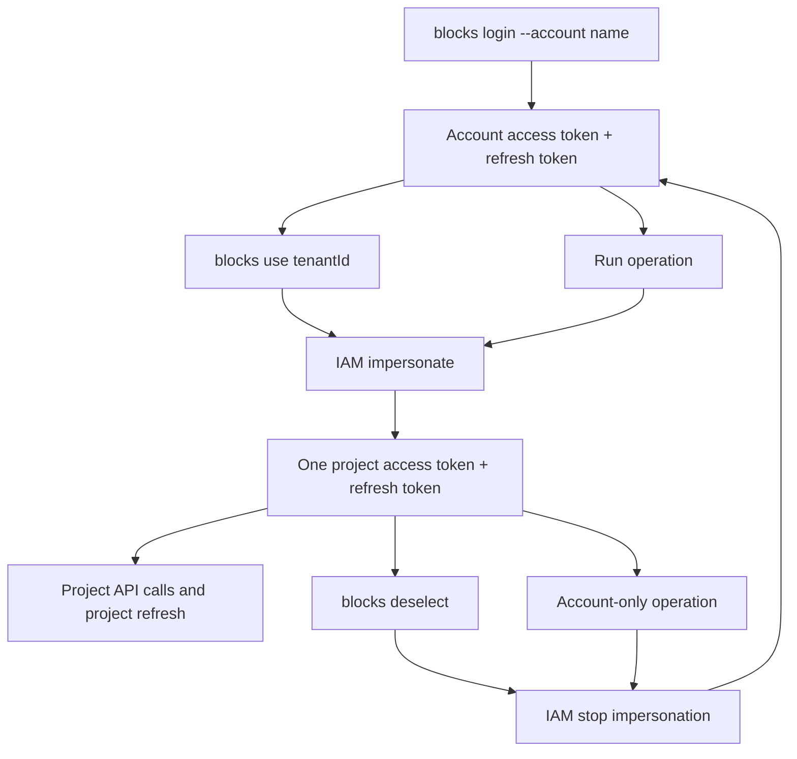

# Blocks CLI

CLI for SELISE Blocks Cloud.

- Package: [`@seliseblocks/cli-os`](https://www.npmjs.com/package/@seliseblocks/cli-os)
- Binary: `blocks`

## Setup

Install the npm package where you want to operate the CLI:

```bash
npm install -g @seliseblocks/cli-os@latest
blocks --version
```

Then log in (device-code flow - prints a verification URL and code, opens
your browser to the verification page when possible so you only need to
click approve, then polls until approved):

```bash
blocks login --account <name>
```

`--account` selects exactly that named profile. Login creates missing profile
metadata from the packaged defaults, but never copies credentials from another
account or config store.

## Account, project, and session context

The CLI resolves its state directory from `BLOCKS_CONFIG_DIR` when that variable
is non-empty. Otherwise it uses the normal per-user OS config directory. Config,
OAuth tokens, client secrets, active account, and selected project all stay in
that resolved store; the CLI does not detect whether it is running locally or in
a VM.

Account resolution is `--account` first, then `activeAccount` from the resolved
store. An explicit missing account fails without falling back. If no valid active
account exists, an interactive terminal asks which configured account to use and
stores that choice as active; non-interactive commands fail with an actionable
error.

Project resolution is `--project`, then `blocks.json`'s `project.tenantId`, then
the selected account's `selectedProject` from the resolved store. An interactive terminal asks for a
tenant id only when none is available; non-interactive commands fail. A
`--project` override applies only to that command and does not change the saved
selection. Successful login establishes `activeAccount`, so normal usage is
`blocks use <tenantId>` followed later by `blocks deselect`; both operate on
that active account.

For Code Studio, the portal backend must validate the portal identity,
`x-blocks-key`, and requested Studio application/project before creating a
session. `x-blocks-key` identifies a tenant/project; it does not prove user
permission. The launcher must provide a unique session/user-specific
`BLOCKS_CONFIG_DIR`. A new directory starts without imported tokens and requires
an explicit login or approved bootstrap.

Each account persists exactly one refreshable authentication mode in its
resolved store: either the account access/refresh pair, or one project's
impersonated access/refresh pair. `blocks use` exchanges account mode for project
mode. `blocks deselect` exchanges project mode back to account mode. Account-only
operations such as project creation temporarily stop impersonation and restore
the previous project afterward. These exchanges are locked per config directory
so concurrent CLI processes cannot overwrite each other's token transition.



On a shared machine, local terminals without an override use the normal OS
config directory. Every Studio launcher supplies a different
`BLOCKS_CONFIG_DIR`, so two portal users can use the same tenant on the same VM
without sharing active account, project selection, client secret, or tokens.

For source development in this repository:

```bash
npm install
npm run build
node bin/run.js --version
```

## Commands

Namespaced commands accept either spaces or colons, e.g. `blocks data schema list` and
`blocks data:schema:list` are equivalent.

Global options available on every command:

| Option | Description |
|---|---|
| `--version` | Print CLI version. |
| `--json` | Print machine-readable JSON where supported. |
| `--api-url <url>` | Override the Blocks API URL for this command. |
| `--account <name>` | Use exactly this account from the resolved config store. |
| `--project <tenantId>` | Override the project for this command without changing the saved selection. |
| `--dry-run` | Show planned mutation without calling the API. |
| `--yes` | Skip mutation confirmation after explicit approval. |

| Command | Description |
|---|---|
| `blocks init` | Create local Blocks workspace files: `blocks.json`, data schema/rules folders, and `.env.example`. |
| `blocks doctor [--json]` | Inspect cached Node.js, OIDC, token, optional project, and config-path state without refreshing tokens or calling Blocks APIs. A valid account-only session succeeds and reports `Project context: not selected (account-only mode)`. |
| `blocks login [--account <name>]` | Device-code login. Explicitly bootstraps a missing named profile without importing credentials from another store, stores account tokens, and makes the successfully logged-in account active. |
| `blocks auth status [--json]` | Show only whether account/project access and refresh tokens are missing, valid, expired, or available. Does not print account config values. |
| `blocks auth refresh [--project] [--json]` | Force account token refresh, temporarily restoring the active project afterward, or directly refresh the project token with `--project`. |
| `blocks auth remove <account>` | Clear cached tokens and stored local credentials for that account. The packaged default OS account is restored from package defaults. |
| `blocks logout` | Revoke the current refresh token when possible and remove local session data. |
| `blocks projects list [--json]` | List accessible Blocks projects via `/os/v4/Project/Gets`. Prefers the selected project's impersonated token and otherwise uses the account token. Read-only. |
| `blocks projects get [tenantId] [--deployment] [--json]` | Read one project from `Project/Gets`. Uses selected project when `tenantId` is omitted. Pass `--deployment` to also include the environment, tenantGroupId, and linked repo assets that `release deploy` resolves internally. Read-only. |
| `blocks projects create <name> [--allow-duplicate-name] [--yes] [--dry-run] [--json]` | Create a new project via `/os/v4/Project/Create` with account authentication. If a project session is active, the CLI stops it, creates and verifies the project, then restores it. Always creates **exactly one application, in the `dev` environment** - environment, domain, cookie domain, and production flag are not configurable, and the domain sent is a placeholder the platform replaces with the one it assigns. Confirms first because it accepts the Blocks terms on your behalf. Refuses a name already used by another project unless `--allow-duplicate-name` is passed. Does not select the new project. |
| `blocks use <tenantId>` | Prepare the project session for `activeAccount`, then save its selected tenant and update `blocks.json` when present. `--account` remains an explicit automation override. |
| `blocks deselect` | Stop the live impersonation session, exchange its project refresh token for a new account token pair, and clear the resolved account's project selection and `blocks.json`. |
| `blocks iam me [--json]` | Read the CLI operator's current IAM identity. Prefers the selected project's impersonated token and otherwise uses the account token. |
| `blocks iam users *`, `iam email available`, `iam roles *`, `iam permissions *`, `iam resources *`, `iam organizations *`, `iam signup-settings *` | Full IAM admin surface for the selected project (users, roles, permissions, resource metadata, organizations and their config, signup settings). Project-scoped: requires a selected project and always uses an impersonated project token, never the account token. Mutating commands support `--dry-run`/`--yes`; rich payloads accept `--body '<json>'`/`--file <path>` on top of common convenience flags. Run `blocks --help` for the full command/flag list. |
| `blocks mfa config *`, `mfa totp *`, `mfa generate`, `mfa resend`, `mfa verify`, `mfa method set`, `mfa disable`, `mfa backup-codes *` | Project-scoped MFA admin and self-service surface (tenant MFA policy, TOTP enrollment, OTP challenge/verify, method switch, backup codes). Same project-selection and impersonation-only rules as IAM above. |
| `blocks mfa totp enable --mfa-type <n> [--code <c>]` | Composed TOTP enrollment: `totp setup` → prints the QR/secret → reads `--code` or prompts interactively → `totp verify-setup` → `method set` → `backup-codes generate`, one confirmation. Non-interactive callers must pass `--code`; otherwise the command fails with `interactive_input_required`. `--mfa-type` is required and not defaulted - `1` is TOTP in IAM's `UserMfaType` enum (`0` None, `1` TOTP, `2` Email, `3` Sms, `4` WhatsApp; only 1 and 2 have a provider). Deliberately excludes `mfa config save` (a separate, tenant-wide admin policy, not part of one user's enrollment). |
| `blocks auth idp *`, `auth config *`, `auth client-credentials *`, `auth oidc-clients *` | Auth admin surface: identity providers, AuthController tenant config, machine-to-machine client credentials, and OIDC client app registrations. Project-scoped, impersonated project token only. `idp delete`, `client-credentials save`/`delete`, and `oidc-clients save`/`delete`/`rotate-secret` return or handle secrets shown only once - treat CLI output as sensitive and never log it. |
| `blocks mail config *`, `mail template *`, `mail mailbox *` | Project-scoped mail admin surface via `/os/v4/Mail/*`: SMTP/inbound configuration upsert/delete/duplicate, mail template CRUD/clone, and mailbox message reads. Impersonated project token only. `mail config save`'s `--account-password` is redacted in `--dry-run` output only. |
| `blocks mail send [--to a,b] [--purpose <p>] [--language <c>] ...` / `mail sendtoany [same, plus --is-test-mail]` | Send an email via `/logic/v4/Mail/Send` / `/logic/v4/Mail/SendToAny`. Impersonated project token only; `--project-key` defaults to the selected project. |
| `blocks notification *` | Project-scoped notification channel configuration via `/os/v4/Notification/*` (list/get/save/delete). Impersonated project token only. `--channel`/`--type` are raw numeric enum values from the API. |
| `blocks notifier notify`, `notifier list`, `notifier unread`, `notifier mark-read`, `notifier mark-all-read` | Real-time/offline notification sends and inbox reads via `/logic/v4/Notifier/*` - distinct from `notification` above, which manages channel configuration, not sending. Impersonated project token only. `notify` targets `--user-ids`/`--roles`/`--subscription-filters`; `unread` sends its filter as query parameters even though swagger documents that endpoint as GET with a JSON body, which the Fetch spec forbids. |
| `blocks secrets get <secretKey>` / `secrets save --secret-key <key> --key-value-pairs '<json>'` | Generic tenant secret storage via `/os/v4/Secrets/*` (e.g. captcha provider config). Impersonated project token only. `save` is an upsert - omit `--item-id` to create, pass it to update. |
| `blocks storage config *` | Project-scoped storage backend configuration via `/os/v4/Storage/*` (list/get/save/delete). Impersonated project token only. `--secret-key`/`--access-key`/`--password`/`--connection-string` are redacted in `--dry-run` output only. |
| `blocks data validate [--json]` | Validate local `blocks/data/schemas/*.json` and `blocks/data/rules.json` before pushing. Local-only. |
| `blocks data schema list [--page <n>] [--page-size <n>] [--json]` | List project schemas via `/data/v4/schemas` using an impersonated project token. Read-only. `--page`/`--page-size` default to 1/100. Validates the response envelope and fails clearly on an unexpected shape instead of treating it as an empty list. |
| `blocks data schema pull [--json]` | Download every project schema (paging through all of them) into `blocks/data/schemas/*.json`. Strips the API `id`, project identifiers, access-policy metadata, and platform-managed fields (`ItemId`, `CreatedDate`, etc.) so the file is portable and re-pushable as-is. Writes local files only. |
| `blocks data schema push [--dry-run] [--yes] [--json]` | Create or update project schemas via `/data/v4/schemas/define`. Mutating. Looks up the destination project's schema by name (never trusts a local `id`/`itemId`, which may belong to another project) and uses PUT with the destination id when found, POST otherwise; warns when a local id is ignored, and fails clearly (nonzero exit) instead of treating an empty/`204` response as success. |
| `blocks data rules pull [--json]` | Download data-access policies into `blocks/data/rules.json` in the CLI's portable format (`schemaName`, not the API's `entityName`; no `itemId`/`schemaId`). Writes local files only. |
| `blocks data rules deploy [--dry-run] [--yes] [--json]` | Apply schema security and data-access policies. Mutating; supports dry-run and confirmation. Resolves each policy's destination schema id and any existing policy id by name -- never reuses a source-project id -- and fails if a policy targets a schema that doesn't exist yet in the destination project. |
| `blocks data reload [--dry-run] [--yes] [--json]` | Reload Data schema configuration so staged schema/rule changes become live. Mutating; calls POST `/data/v4/schema-configurations/reload`. |
| `blocks data sync [--dry-run] [--yes] [--json]` | Composed flow: validate local schemas/rules → `data schema push` → `data rules deploy` → `data reload`, one confirmation. Use this instead of running the three separately - nothing else calls `data reload` automatically, so pushed changes can otherwise sit staged without going live. Prints 3 separate step outputs, not one combined document. |
| `blocks data config get/create/update` | Tenant data-source configuration via `/data/v4/configurations` - check `get` first, it defaults to Blocks-managed storage; `create`/`update` point the gateway at an external database. Impersonated project token only. |
| `blocks data schema get/get-by-name/aggregation/change-logs/delete/fields/info *` | Raw `/data/v4/schemas*` API beyond the file-oriented `list/pull/push` above: single-schema/by-name lookups, access-level aggregation, unadapted change logs, delete, and a metadata-first (`info *`) plus field-only (`fields`) alternative to `push`. Run `blocks --help` for the full flag reference. `schema get` additionally prints the schema's exact GraphQL operation names in non-`--json` output -- generated names are naive string concatenation (`get{QuerySchema}`, `insert{SchemaName}`, `insertMany{SchemaName}`, etc.), not English pluralization, so e.g. `Company` becomes `getCompanys`/`Companys`, not `Companies`. |
| `blocks data rules policy get/delete` | Single data-access policy read/delete via `/data/v4/data-access/policy/*`, alongside the bulk file-oriented `rules pull/deploy` above. |
| `blocks data validation list/get/by-schema/by-schema-field/save/delete` | Field-level validation rules via `/data/v4/data-validations*`. No file-oriented workflow exists for this yet; `save` is an upsert (omit `--item-id` to create) and requires a `validations` array via `--body`/`--file`. |
| `blocks data files upload --file <path> [--local-storage]` | Composed upload: cloud storage creates the file/version record and PUTs the bytes; local storage uses one multipart request. The file is immediately part of the object tree—there is no DMS registration step. |
| `blocks data files *` | Full storage object-tree surface: file get/upload/metadata/delete/version/copy/move/rename, directory CRUD/move, cursor-paginated list/search/shared/trash, restore/purge, and access policy/share/inheritance commands. Delete defaults to trash; pass `--permanent` explicitly to remove data. Run `blocks --help` for flags. |
| `blocks localization validate --module <name> --language <culture> [--file <path>] [--json]` | Validate a local i18n JSON dictionary. Supports nested JSON input and checks the flattened key/value set locally. |
| `blocks localization push --module <name> --language <culture> [--file <path>] [--route <route>] [--context <text>] [--dry-run] [--yes] [--json]` | Create or update Localization keys from local i18n JSON via `/localization/v4/Key/SaveKeys`. Creates the module first through `/localization/v4/Module/Save` when missing. |
| `blocks localization pull --module <name> --language <culture> [--out <path>] [--json]` | Download published cloud localization via `/localization/v4/Key/GetCloudUilmFile` and write a local JSON dictionary. |
| `blocks localization key translate-and-export --module-id <id> [--wait]` | Composed flow: `translate-all` → `generate-uilm-file` → `uilm-export`. With `--wait`, polls translation progress (via a self-generated correlation id) before generating/exporting, since translation runs asynchronously; without it, fires all 3 back to back. Prints one output block per step. |
| `blocks localization assistant translation-suggestion`, `localization config *`, `localization glossary *`, `localization key *`, `localization language *`, `localization module *` | Full raw `/localization/v4/*` API surface (AI translation suggestions, tenant webhook config, glossary CRUD, key CRUD/search/timeline/translate/UILM import-export/rollback, language CRUD, module CRUD/glossary tagging) alongside the file-oriented validate/push/pull commands above. Project-scoped, impersonated project token only. Run `blocks --help` for the full command/flag list. |
| `blocks release deploy [--domain <customDomain>] [--wait] [--poll-interval <s>] [--timeout <s>] [--dry-run] [--yes] [--json]` | Deploy the selected project's environment. No `--repo-id` needed - resolves the linked repo via `Project/GetAsset` and its connected branch via `Build/repo-details`, and aborts if that branch doesn't match the environment name. Pass `--domain` to also set the custom deployment domain first. Pass `--wait` to poll `release status` on the resulting build until it reaches a terminal state instead of returning immediately with just a build id. Mutating; no artifact upload is performed by this CLI. |
| `blocks release status <buildId> [--json]` | Read Release build status by build id. Read-only. |
| `blocks release builds list [repoId] [--repo-id <repoId>] [--json]` | List Release build details for a repository. When `repoId` is omitted, resolves it from the selected project's linked repo assets - auto-picked if there's exactly one, otherwise prompts interactively. Non-interactive callers must pass the positional `repoId` or `--repo-id`; otherwise the command fails with `interactive_input_required`. Read-only. |
| `blocks release builds get <buildId> [--json]` | Alias for `release status`. Read-only. |
| `blocks new web <name> [--app-domain <domain>] [--client-id <oidcClientId>] [--x-blocks-key <tenantId>] [--blocks-api-url <url>] [--oidc-url <url>] [--yes]` | Create a Vite React starter app that talks to Blocks exclusively through `@seliseblocks/client` using the SDK hosted IdP flow. Uses the selected project unless `--x-blocks-key` overrides it. Omitted domain/client values may be resolved interactively; non-interactive callers must provide `--app-domain` and `--client-id`. Before writing scaffold files, the command verifies OIDC login and may update the project's AuthController configuration; non-interactive callers must pass `--yes` after approval. Any prompt, OIDC lookup, confirmation, or enablement failure occurs before scaffolding. When `--blocks-api-url` is omitted, the command derives it from the app domain; `--oidc-url` defaults to `https://iam.seliseblocks.com`. |

Use `--json` on commands when AI or automation needs machine-readable output. Use `--dry-run` before mutations and `--yes` only after approval.

For agent-specific operating rules and command sequences, see [AI_USAGE_GUIDE.md](AI_USAGE_GUIDE.md).

### Scaffolded Web App Local HTTPS

For `blocks new web`, `--app-domain` should be the app's real Blocks domain/origin, for example `https://dbpdba.seliseblocks.com`. The generated app keeps that full value as `VITE_BLOCKS_APP_DOMAIN` and derives the local dev host without a scheme as `VITE_BLOCKS_DEV_HOST=dbpdba.seliseblocks.com`.

Browser login uses the hosted Blocks IAM IdP flow and secure cookies, so local testing on the project domain must run over HTTPS:

```bash
cd <appName>
npm install
npm run cert
npm run dev
```

Add the generated `VITE_BLOCKS_DEV_HOST` to your hosts file, for example:

```text
127.0.0.1 dbpdba.seliseblocks.com
```

Then open `https://<VITE_BLOCKS_DEV_HOST>:5173`, not plain `http://`. The generated cert script uses a Node dependency, so it works from normal PowerShell after `npm install`; OpenSSL/Git Bash is not required.

OIDC account settings are saved in the OS-specific config directory. Access and refresh tokens are stored in an OS-aware secure backend when available, and are refreshed automatically before cloud commands when a refresh token is available.

OAuth tokens use an OS-aware credential backend:

| OS | Credential backend |
|---|---|
| Windows | DPAPI-encrypted value in the CLI secret metadata file, scoped to the current Windows user. |
| macOS | Keychain generic password for the `seliseblocks-cli` service. |
| Linux | Secret Service through `secret-tool` when available. |
| Fallback | `0600` file storage in the CLI config directory. Set `BLOCKS_SECRET_STORE=file` to force this mode for CI or minimal containers. |

Use `blocks doctor` or `blocks auth status` to see which backend is active. Tokens are never printed by CLI status commands.

If the active OS credential backend cannot decrypt old local auth state after a Windows profile change, machine migration, Keychain reset, or corrupted token cache, clear local auth state and log in again:

```bash
blocks auth remove <account>
blocks login --account <account>
```

## Workspace

`blocks init` creates:

```text
blocks.json
blocks/
  data/
    schemas/
    rules.json
.env.example
```

Localization dictionaries are not created by `init` - the default path is `blocks/localization/<module>.<language>.json`, for example `blocks/localization/common.en.json`, and the `blocks/localization/` folder is created lazily the first time `blocks localization pull` writes to it. AI agents can create or update that file directly (before `push`, which only reads it), run `blocks localization validate`, then push it to the Localization service with `blocks localization push --dry-run` followed by `--yes` after approval. Gateway v4 routes do not include an `/api` segment.

After login selects `activeAccount`, `blocks use <tenantId>` updates that account's selected project and `blocks.json` when present. `blocks deselect` clears the same active account's selection. Different accounts in the same config store retain independent selections when each becomes active through login.

`blocks release deploy` has no local config file - it needs a repo already linked to the project. Linking a repo requires GitHub OAuth, which only the Blocks portal can do; if none is linked, the command tells you so and stops.

## Boundaries

- `iam me` reads the CLI operator's own identity, preferring project auth when a project is resolved and using account auth only in account-only mode. Every other `iam *`, `mfa *`, `auth idp *`/`auth config *`/`auth client-credentials *`/`auth oidc-clients *`, `mail *`, `notification *`, `notifier *`, `secrets *`, and `storage config *` command is project-scoped and requires a selected project (`blocks use <tenantId>`) plus an impersonated project token.
- Data covers tenant data-source configuration, schema/rules/reload/validate, field-level validation rules, and the storage object tree (`data files *`). Prefer the composed `data sync` and `data files upload` workflows.
- Localization covers dictionary validate/pull/push plus the full raw `/localization/v4/*` API surface (assistant, config, glossary, key, language, module). Prefer `localization key translate-and-export` over running translate/generate/export by hand.
- Release covers deploy trigger and build status/read commands only.
- No direct artifact upload unless Blocks Release adds a confirmed artifact upload API.
- `projects create` creates a `dev`-only, single-application project. It cannot add environments to an existing project or create a non-`dev` one - those still go through the Blocks portal.
